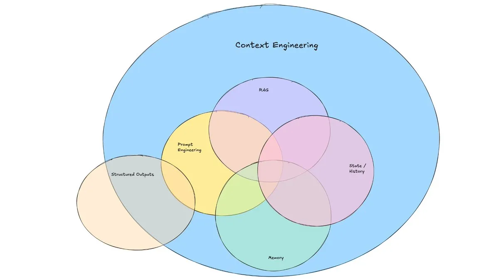
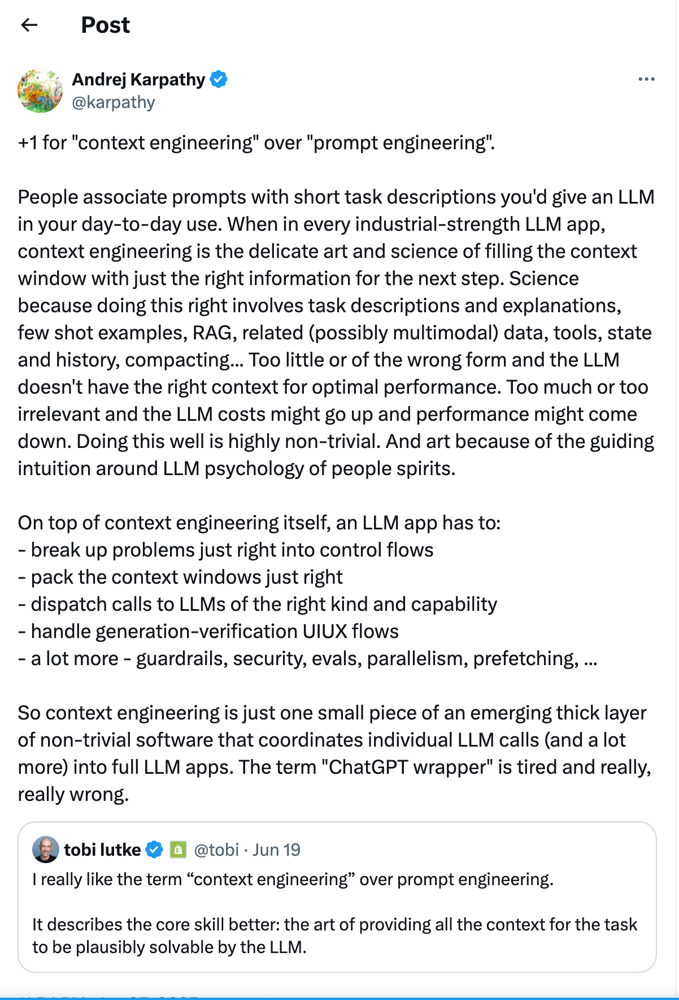

# **什么是Context-engineering(上下文工程)**

@by lx1229

随着大模型能力的提升和交互方式的发展，LLM可接受的输入格式和输出能力都显著增强。最初，我们通过静态文本提示词与模型进行即时对话式交互。如今，随着RAG、Function Call、MCP等技术的出现，用户与模型的交互方式已远超传统的prompt范畴，变得更加多样和高效。

上下文工程涉及系统性地设计、构建和优化LLM的信息环境。与传统的提示词工程不同，上下文工程考虑的是影响AI响应和行为的更广泛信息框架。

# 什么是上下文？

上下文是指在LLM生成响应前，能够提供给模型的所有相关信息。其范围包括但不限于：

- 系统指令和用户指令：用于明确模型的角色、任务和行为规范。
- 样本示例：通过示例帮助模型理解任务要求和输出格式。
- 模型运行规则及输出规则：定义模型的工作流程和期望结果标准。
- 外部数据：如数据库、知识库、API返回的数据等，为模型提供实时或专业信息。
- 对话历史记录：保留用户与模型的交互过程，支持上下文连续性和记忆。
- 长期记忆内容：存储和调用历史知识、经验或重要信息，提升模型智能。
- 工具和函数：为模型提供可调用的外部能力，实现复杂任务处理。
- 环境变量和配置：包括运行环境、参数设置等影响模型行为的信息。
- 其他辅助信息：如用户画像、任务背景、业务逻辑等，有助于提升模型输出质量。

通过合理设计和动态管理上下文，可以显著提升LLM的理解能力和响应质量。

# 上下文工程主要做什么？

上下文工程的核心目标，是通过工程化方法，在LLM运行的每一步为AI动态提供准确、即时、有效、全面且简练的信息，从而提升模型输出质量。其主要内容包括：

- 准确的指令：仅包含与当前任务直接相关的信息，减少无关内容，避免干扰模型推理。
- 最新的知识：为模型提供最新的专业知识和运行历史记忆，确保信息时效性。
- 有效的结构：内容具备良好逻辑和结构，便于LLM高效获取和理解信息。
- 全面的信息：不仅有指令，还包括必要的知识、工具信息及其他有助于提升任务质量的相关内容。
- 简练的内容：内容清晰简短，避免信息过多或过少，降低幻觉和信息丢失风险。

# 上下文工程的主要研究内容包括：

- 上下文检索技术：涵盖高级RAG、MCP和记忆机制，实现高效的信息获取与动态调用。
- 上下文优化技术：包括内容压缩、结构优化、效果评估和信息隔离，提升上下文质量与模型表现。
- 上下文管理技术：聚焦复杂Agent应用中的多层次、动态的数据流转与管理。

# 相关阅读

https://blog.langchain.com/context-engineering-for-agents/  langchain发布的关于上下文工程的文章

