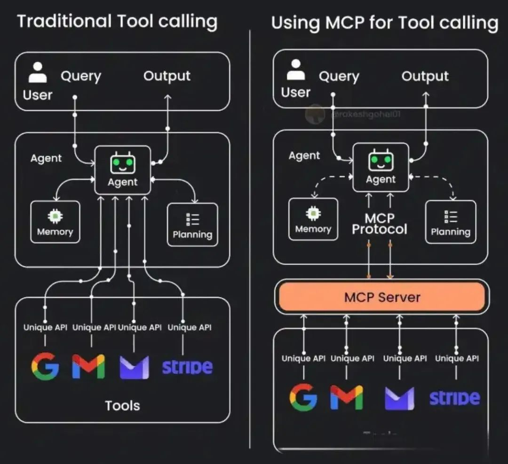

# 什么是模型上下文协议(MCP)

by @lx1229

**模型上下文协议**（英文全称 Model Context Protocol，简称 MCP）是 [Anthropic 于 2024年11月](https://www.anthropic.com/news/model-context-protocol) 推出的开放标准和开源框架，旨在标准化大型语言模型 (LLM) 等人工智能 (AI) 系统与外部工具、系统和数据源的集成与数据共享方式。

## MCP 的背景与意义

随着 AI 技术的快速发展，LLM 与外部世界交互的方式发生了巨大变化。LLM 的上下文范围和内涵不断扩展，其能力也在持续增强。在 MCP 出现之前，我们已经可以通过 Function Call（函数调用）的方式为 LLM 提供定制化的能力扩展，使其能够访问外部工具和数据。

然而，随着 LLM 与外界交互方式的多样化，可供调用的函数和工具越来越多，这就需要一个新的标准或协议来统一管理这些接口。MCP 正是应运而生，它可以被简单理解为对 Function Call 的标准化和统一化管理框架。

## 为什么要使用 MCP

MCP 提供了多方面的优势，使其成为 AI 系统开发中的重要组件：

- **统一标准化管理**：为各类工具和接口提供统一的开发和管理标准，简化集成流程
- **增强通用性与灵活性**：使工具在不同 AI 系统间具有更高的通用性，同时提供更灵活的使用方式
- **提升系统扩展性**：通过支持 MCP，AI 系统可以直接使用已有的兼容工具，大大提高系统的扩展能力
- **优化工具效能**：LLM 可以通过对 MCP 的预训练和适配，更有效地利用各种工具
- **提升AI应用能力**：通过更精准的工具调用和数据访问，整体提升 LLM 的响应质量和效率

## MCP 的核心概念

MCP 主要由以下几个核心概念构成：

1. **MCP Server**：作为工具和资源的提供者，管理各种工具的接口和访问控制
2. **MCP Client**：内置于 AI 系统中，负责与 MCP Server 通信并调用相应工具
3. **工具（Tools）**：执行特定功能的组件，如网络搜索、数据分析、内容生成等
4. **资源（Resources）**：可供 AI 模型访问的数据源，如文件、API 响应或系统信息

## 如何应用 MCP
实施 MCP 架构通常包含以下步骤：
- 配置 MCP Server：搭建服务器环境，定义工具和资源的接口规范。
- 集成 MCP Client：在 AI 应用中实现 MCP 客户端，实现与服务器的通信机制。
- 接入工具和资源：将所需工具和数据源注册并连接到 MCP Server。
- 定义输入输出模式：为每个工具指定标准化的输入参数和输出格式，确保数据一致性。
- 测试与优化：验证工具调用流程的稳定性，并根据实际需求持续优化系统性能。

模型上下文协议（MCP）代表了 AI 系统与外部世界交互的重要进步。通过标准化的接口和协议，MCP 使 LLM 等 AI 系统能够更有效地利用外部工具和资源，拓展其能力边界。
